**SENG 438- Software Testing, Reliability, and Quality**

**Lab. Report \#5 – Software Reliability Assessment**

| Group \#:      |
| -------------- |
| Student Names: |
| Aleksander Rudolf                |
| Anshdeep Singh              |   
| Jannine Osman               |   
| Jaskaran Bhatia                | 

# Introduction

Our group used reliability assessment tools in the lab to analyze provided integration test data. We assessed the failure data through reliability growth testing and a reliability demonstration chart. We used multiple tools to analyze the data such as C-SFRAT and RDC-11. After completing our assessments using reliability growth testing and reliability demonstration charts, we compared the results of the two assessment techniques and their similarities and differences. 

# Assessment Using Reliability Growth Testing 

## Result of model comparison (selecting top two models)

Using the available failure data, we had to choose the top two models for this part of the lab assignment. Using the C-SFRAT application has the benefit of allowing us to quickly import the CSV file into its user interface and use its functionalities to decide which fit for our data was best. The process of selecting the best function that closely reflects the failure data was made easier with the help of the Model Results and Predictions feature. We looked at all possible covariate combinations to identify the two best models. As a result, we were able to study and evaluate a variety of models to find the ones that best matched our failure data.

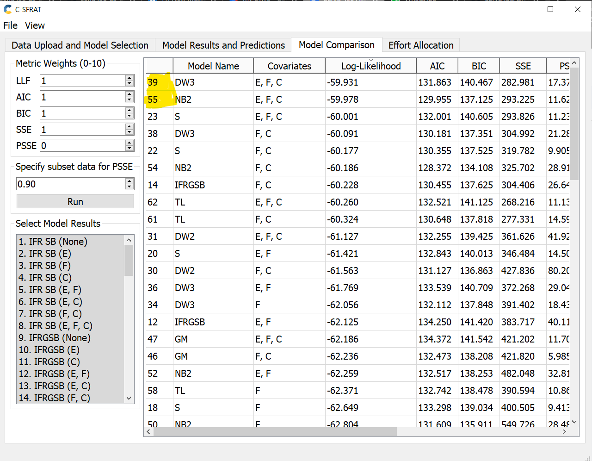

By taking help from this table, we can see that the log-likelihood which is basically a test to compare two models, concentrating on the improvement with respect to likelihood value. From the log-likelihood values, we were able to make out the DW3(E,F,C) and NB2(E,F,C) were the two models that are the closest to our failure data set. DW3 means Discrete Weibull (Type III) and for NB we have not been through that topic in the class so we cannot go in detail over that.

## Result of range analysis (an explanation of which part of the data is good for proceeding with the analysis)

In order to find the best models from the ones the C-SFRAT gave us, we had to look at the data that would most closely match the spots on the failure data graph for the range analysis. We looked over at the log-likelihood column and find the two numbers which were the biggest when compared to other numbers. The numbers are (-59.978,-59.931). This is how we were able to identify our top two models.

## Plots for failure rate and reliability of the SUT for the test data provided

### MVF Graph of Imported Data

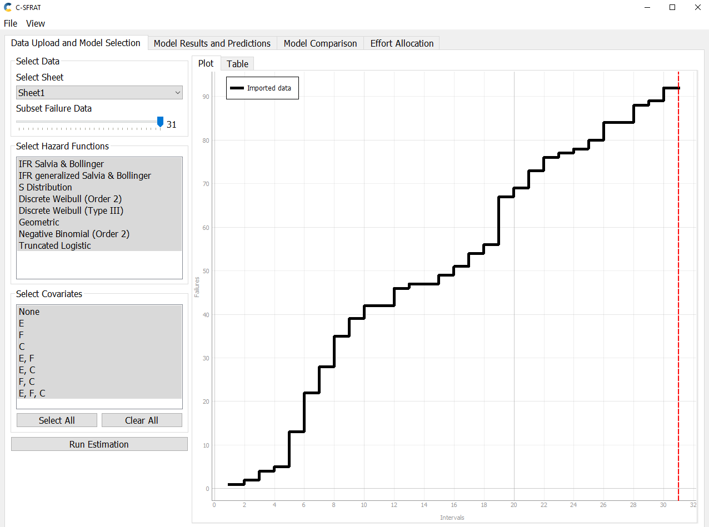

### MVF Graph of All Models with Imported Data

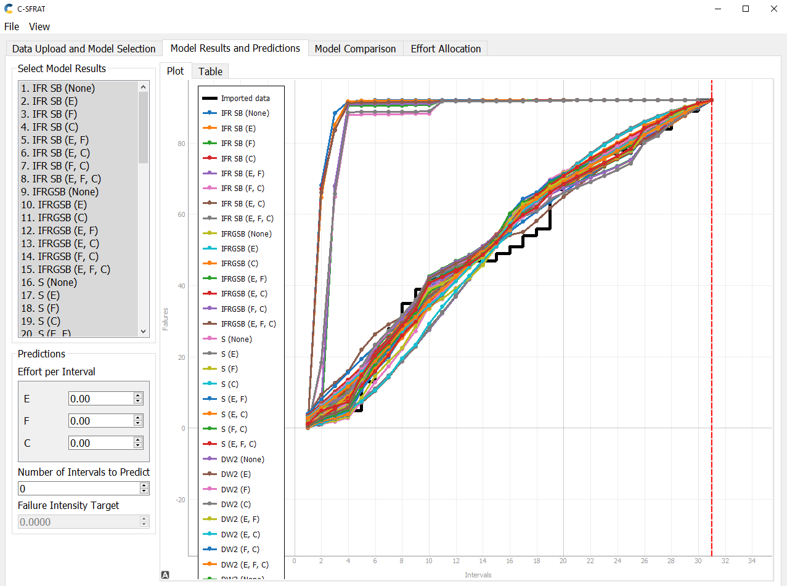

### MVF Graph of DW3(E, F, C) with Imported Data

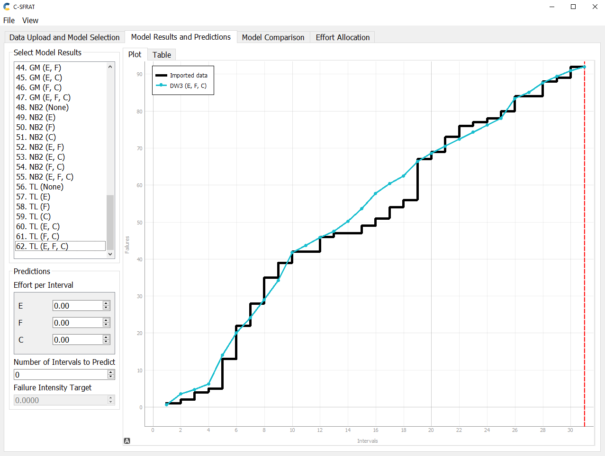

### Intensity Graph of DW3(E, F, C) with Imported Data

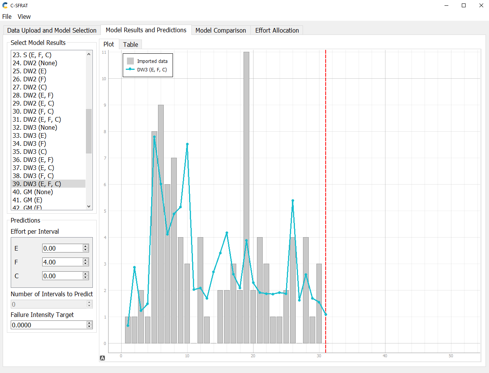

### MVF Graph of NB2(E, F, C) with Imported Data

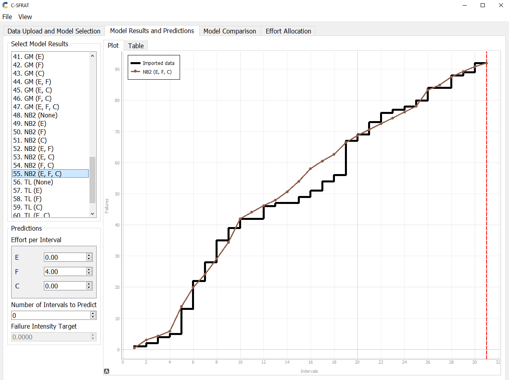

### Intensity Graph of NB2(E, F, C) with Imported Data

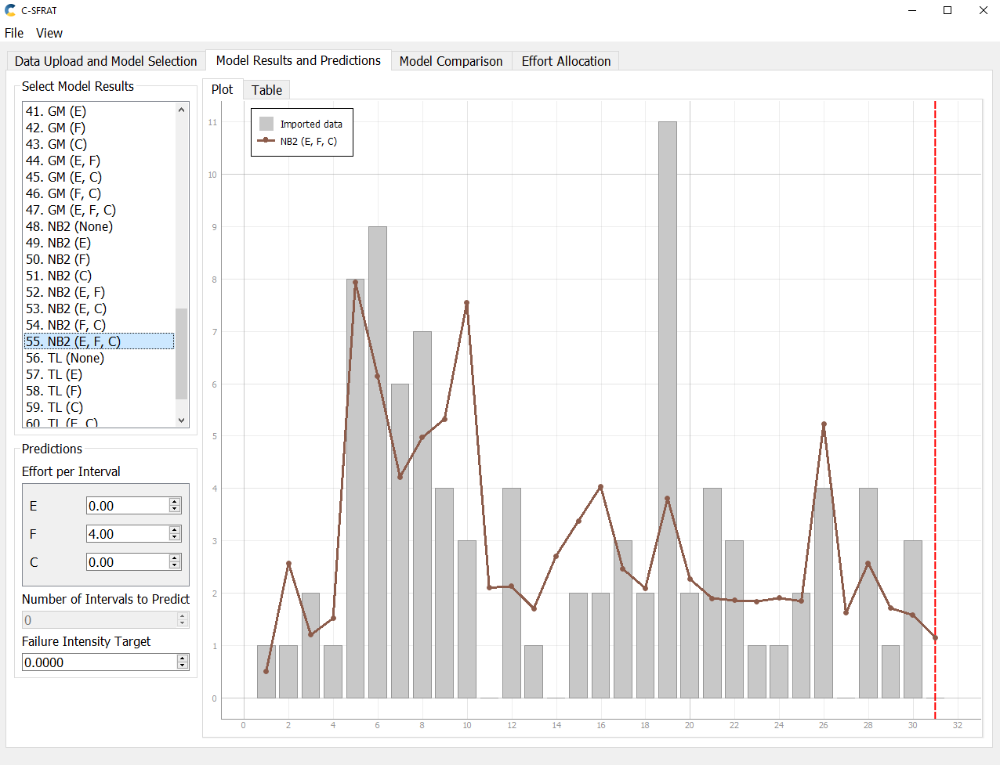

## Reliability Graph Prediction (C-SFRAT)

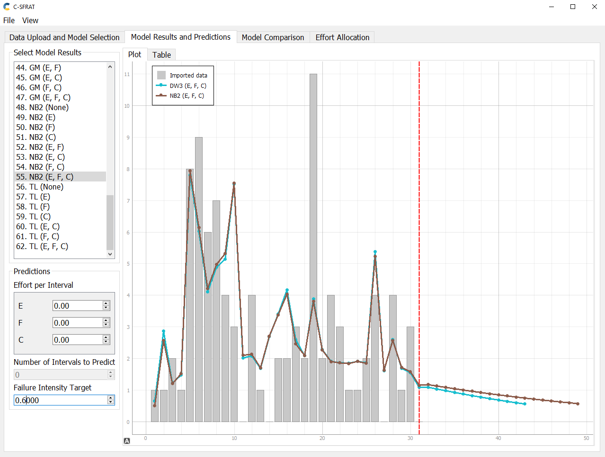

## A discussion on decision-making given a target failure rate

The C-SFRAT tool was utilized to predict the failure rate, which involved dividing the total number of failures by the duration of the system's operation. This rate is crucial in determining the potential for improvement in testing, as it provides an estimate of the number of failures end-users may experience upon the software's release. Our aim was to achieve the lowest possible failure rate to ensure the security and safety of the application for its users. To this end, we set a target failure rate of 0.6, which was determined by averaging the lowest intensities of DW3 and NB2 which was 0.699 and 0.51 respectively, falling within the expected intervals of the intensity graph. Meeting this target rate will provide reliability to the system under testing, as well as any subsequent data derived from it.

## A discussion on the advantages and disadvantages of reliability growth analysis

### Advantages

One advantage of reliability growth analysis is that it allows us to monitor and analyze the product's improvement over time by measuring failures against time. This enables us to ensure that the trend is positive, indicating an increasing time between failures and hence, an improved product. Another benefit of reliability growth analysis is that it makes it easy to identify the impact of changes at specific points, whether positive or negative, on the product's performance. If the trend on the graph decreases, it suggests that the changes implemented are causing more failures, and therefore, the implementation can be modified to minimize failures. Additionally, if the product experiences many failures at the start, the graph will indicate this, enabling the team to modify the plan and improve the product.

### Disadvantages

One disadvantage of reliability growth analysis is that it can be time-consuming and require significant effort to format the input data in a way that is compatible with the analysis tool. Additionally, obtaining and measuring the necessary data for the analysis accurately can be challenging during product development, making it difficult to produce an accurate trend on the graph. Furthermore, reliability growth analysis relies on models to predict the future failure rate of the product. These models may not always accurately represent the actual failure rate, as they are just a prediction. Therefore, it may be necessary to use other tools to supplement the analysis and provide a more accurate prediction.

# Assessment Using Reliability Demonstration Chart 

## 3 plots for MTTFmin, twice, and half of it for your test data

### MTTFmin

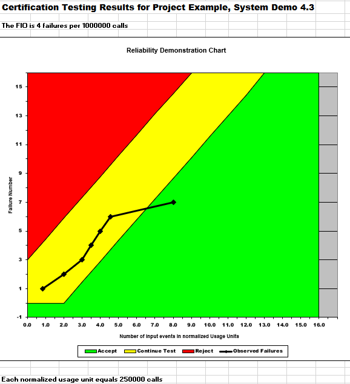

The above image displays the plot for MTTFmin. Using the provided failure data as input, we generated the graphic above by trial and error in order to illustrate the system's dependability. The dependability trend plotted indicates that the pattern is appropriate for our FIO. The calculation for MTTF, in this case, is 4/100,000, which gives an MTTF of 0.000004.

### MTTFmin Double

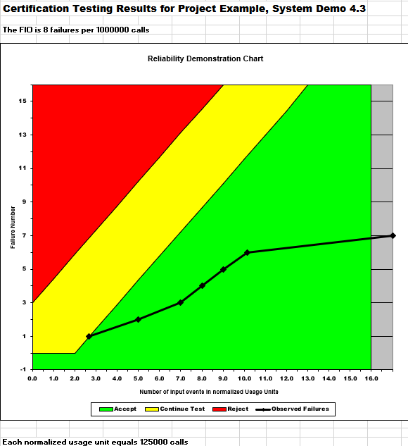

The calculation for MTTF, in this case, is 8/100,000, which gives an MTTF of 0.000008. With the revisions we made to this graph, this trend is now more closely inside the permitted range. Our failures in the twice MTTF plot should have more data points in the accepted region because we raised the number of acceptable failures.

### MTTFmin Half

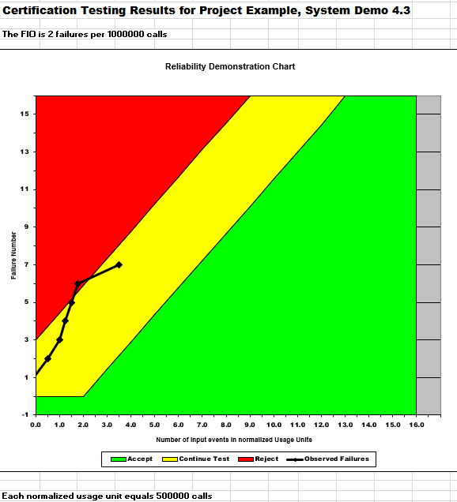

The above image displays the plot for half MTTF. After the MTTFmin plot was found, the parameters were adjusted accordingly for half of the previous MTTF. The calculation for MTTF, in this case, is 2/100,000, which gives an MTTF of 0.000002. With the alterations we made to this graph, this trend is more likely to fall under the reject range. Our failures in the half MTTF plot should have more data points in the reject region because the number of permissible failures was reduced.

## Explain your evaluation and justification of how you decide the MTTFmin

Our approach for finding an appropriate MTTFmin was trial and error. We adjusted the data so that the majority of the plot was in the yellow area of the graph. When the majority of the graph lay in the yellow region we knew the MTTF was at an ideal value. When determining the value for MTTF we tried whole values divisible by 2. We tested 2 failures, 4 failures, 6 failures and so on. After this method, we found 4 failures per 1 million input events were acceptable MTTFmin. Our MTTFmin was 4 failures / 1,000,000 = 0.000004. With 0.000004 as our MTTFmin value, the majority of the graph lay in the yellow region.

## A discussion on the advantages and disadvantages of RDC

### Advantages

Visual representation: Since it is very simple to put together a spreadsheet and figure out how the SUT performs, RDC enables real-time monitoring of system performance and reliability. RDC offers a clear, visual depiction of the reliability data, making it simpler to comprehend and analyze how well a system or product performs.
Support for decision-making: RDC supports the allocation of resources and the improvement and modification of products. Engineers and management can use it to pinpoint problem areas and rank improvements in accordance with the chart.

### Disadvantages

Data quality: The quality of the data used to develop RDC has a significant impact on its correctness and dependability. Inaccurate or lacking data might produce false conclusions and misleading results. For the chart to yield valuable insights, the data must be accurate and relevant. Also, the calculation of MTTF involves a lot of hit-and-trial methods and is a tiring process.
Restricted scope: Mean Time To Failure (MTTF) and other time-based reliability indicators are the main areas of focus for RDC. Analysis of other reliability factors like availability, maintainability, or safety might not be as successful. Also, it cannot output a quantitative number for the reliability of the system.

# Comparison of Results

RGT can be used while a product or system is being developed and improved. It helps in fault detection and removal, reliability estimation, and tracking performance toward reliability goals. The design and development stage is where RGT is most effective for assessing and enhancing the product's reliability. Reliability Growth Testing is useful while making changes or upgrades to an established product, to consider how these changes would affect reliability.

Use RDC in the final stage of product validation as during this stage, the software code is frozen. Before a product or system is made available on the market, it ensures that a certain dependability level has been reached. RDC is ideal for proving that a system or product has attained a particular reliability level, giving stakeholders assurance (customers, suppliers, regulatory agencies). Also, it can be used to compare the reliability performance of various goods, design options, or maintenance techniques.

# Discussion on Similarity and Differences of the Two Techniques

## Similarities

Both reliability growth analysis and reliability demonstration charts have the overall aim to improve product reliability and they both require data collection and analysis using different tools. Both techniques are based on inter-failure time and a target failure rate (MTTF).

## Differences

Reliability growth analysis is based on inter-failure times or failure count, as well as a target failure rate or mean time to failure (MTTF). In contrast, a reliability demonstration chart only considers inter-failure times and a target failure rate or MTTF. The main objective of reliability growth analysis is to monitor and improve the reliability of a product over time, while a reliability demonstration chart focuses on whether a product meets a specified reliability rate at a specific point in time. Reliability demonstration charts also require less data than reliability growth analysis since they only need enough data to demonstrate that the product meets the reliability requirements at that point in time. In contrast, reliability growth analysis shows the reliability of the product over time and requires more data to produce an accurate trend.

# How the team work/effort was divided and managed

Our team collaborated on all aspects of the lab, working together to complete the various tasks. Although one team member encountered issues using C-SFRAT on their computer, we still managed to work as a team for the first portion of the lab, formatting the data. Other members of the group utilized the formatted data in the C-SFRAT tool, and we worked together to analyze the results. In the second part of the lab, one team member inputted the formatted data into the RDC-11 software, and the entire group worked together to analyze the results. Finally, we collaborated to compare the two techniques and complete the remaining elements of the report. This collaborative approach allowed us to support one another in troubleshooting and becoming proficient with the tools we used.

# Difficulties encountered, challenges overcome, and lessons learned

During the lab, our group faced significant challenges when it came to inputting data into the respective tools. Initially, we planned to use SRTAT, but we encountered difficulties as none of our group members could get it to work on our computers. As a result, we shifted our focus to C-SFRAT, which also presented us with various issues. One of our group members was unable to use C-SFRAT because they had a Mac computer, which made it difficult to allocate tasks among the four of us. Additionally, we had difficulty determining the appropriate format for our input data. Using these new tools proved to be incredibly frustrating since we had limited guidance on how to use them. We lacked knowledge on how to input data, modify tool settings, and interpret the software's results. While RDC-11 software provided a slightly better experience compared to C-SFRAT, we still struggled to comprehend the results.

# Comments/feedback on the lab itself

In retrospect, our group felt we could have benefited from more guidance on the tools introduced during the lab. We spent the entirety of our lab period attempting to get C-SFRAT to function correctly, and even after we managed to get it working, we lacked confidence in the validity of our results. With additional instructions or a live demonstration, we would have been better equipped to complete the lab within a reasonable timeframe.
