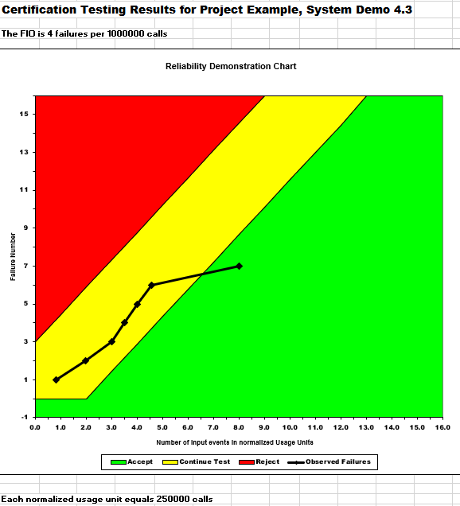
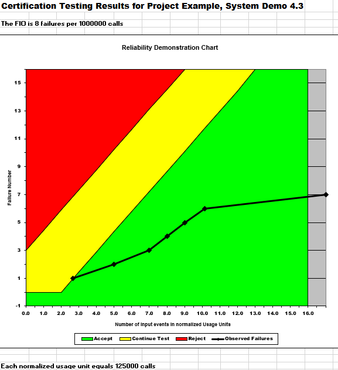
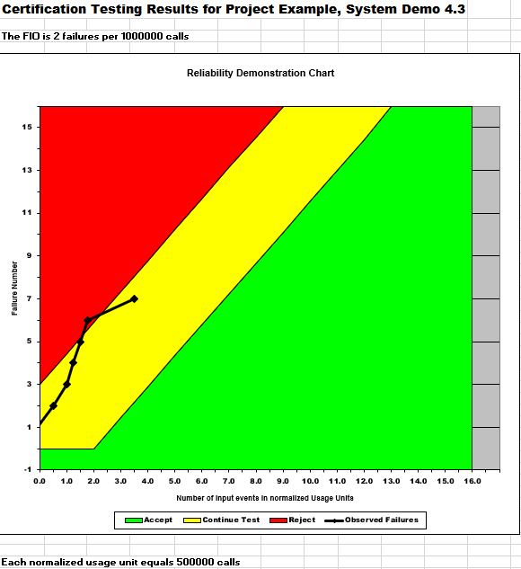

**SENG 438- Software Testing, Reliability, and Quality**

**Lab. Report \#5 – Software Reliability Assessment**

| Group \#:      |
| -------------- |
| Student Names: |
| Aleksander Rudolf                |
| Anshdeep Singh              |   
| Jannine Osman               |   
| Jaskaran Bhatia                | 

# Introduction

# 

# Assessment Using Reliability Growth Testing 

# Assessment Using Reliability Demonstration Chart 

# 

# Comparison of Results

# Discussion on Similarity and Differences of the Two Techniques

# How the team work/effort was divided and managed

# 

# Difficulties encountered, challenges overcome, and lessons learned

# Comments/feedback on the lab itself
